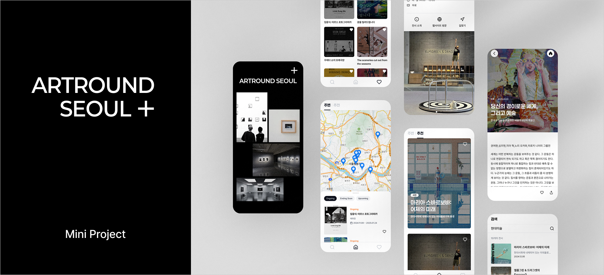

# ARTROUND SEOUL



## 📌 프로젝트 소개

아트라운드 서울은 전시 정보를 손쉽게 탐색할 수 있도록 만든 **모바일 전용 웹 서비스**입니다.  
앱처럼 부드럽고 직관적인 UI/UX를 제공하며, 사용자는 전시 리스트를 확인하고, 각 전시의 주소 정보를 기반으로 카카오 지도와 연동된 위치를 확인할 수 있습니다.

## 🔍 주요 기능 및 특징

- 390px 고정 해상도를 기반으로 모바일 기기에 최적화된 앱 유사 UI/UX 제공
- 목업 데이터 및 로컬스토리지를 활용한 전시 정보 구성과 좋아요(찜) 기능 구현
- 카카오 지도 API와 연동된 주소 기반 위치 표시로 전시 공간을 직관적으로 확인
- 리스트, 상세, 검색, 지도 화면 등 전시 정보 흐름을 직관적인 인터랙션으로 연결

## 🛠️ 기술 스택

### 프론트엔드


## ⚙️ 설치 및 실행

```bash
# 레포지토리 클론
git clone https://github.com/seeo00/artround-seoul.git

# 디렉토리 이동
cd artround-seoul

# 패키지 설치
yarn install

# 개발 서버 실행
yarn dev

# .env 파일 설정
`.env.example` 파일을 참고하여 프로젝트 루트 디렉토리에 `.env` 파일을 생성해 주세요.
```

> Next.js 기반 프로젝트입니다.  
> 브라우저에서 http://localhost:3000 으로 접속하면 됩니다.

## 📂 폴더 구조

```bash
src/
├── app/
│   ├── exhibition/
│   │   ├── details/
│   │   └── overview/
│   ├── home/
│   ├── liked/
│   ├── recommend/
│   ├── search/
│   ├── utils/
│   │   └──  hooks/
│   ├── layout.js
│   └── page.js
├── components/
├── context/
├── data/
├── styles/
└── theme/
```

---

💬 Next.js를 처음 사용해 진행한 개인 미니 프로젝트입니다. 모바일에 최적화된 UI, 로컬스토리지 기반 좋아요 기능, 카카오 지도 연동 등을 직접 구현하며 프레임워크의 구조와 활용 방식에 대해 실습할 수 있었던 의미 있는 경험이었습니다.
